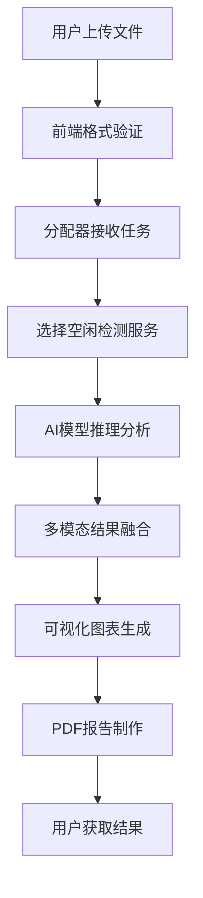

# CUCDFD 深度鉴伪系统

一个基于深度学习的多媒体内容真伪检测系统，支持视频、音频和图像的深度伪造检测。

## 📋 目录

- [系统概述](#system-overview)
- [系统架构](#system-architecture)
- [环境要求](#environment-requirements)
- [快速开始](#quick-start)
- [详细使用说明](#detailed-usage)
- [配置说明](#configuration)
- [API接口](#api-reference)
- [监控和调试](#monitoring-debugging)
- [故障排除](#troubleshooting)
- [项目结构](#project-structure)
- [常见问题](#faq)

## <a id="system-overview"></a>📊 系统概述

CUCDFD（白杨智鉴）是一个综合性的深度伪造检测系统，集成了多种最先进的检测算法，提供音视频联合鉴伪能力。

### 🎯 主要特性

| 特性 | 描述 |
|------|------|
| 🔍 **多模态检测** | 支持视频、音频、图像三种媒体类型 |
| 🤝 **媒体联合鉴伪** | 音视频同步分析，提高检测准确性 |
| 🚀 **分布式架构** | 支持多GPU分布处理，提高检测效率 |
| 🌐 **Web界面** | 提供友好的前端交互界面，支持桌面端和移动端 |
| 📊 **详细报告** | 生成专业的检测报告（PDF格式） |
| 🔧 **灵活配置** | 支持动态配置和扩展 |

### 🎨 支持的检测类型

- **DeepFake视频检测**: 检测人脸替换、表情操控等视频篡改
- **语音合成检测**: 识别AI生成的合成语音
- **AI生成图像检测**: 发现AI生成的图像内容
- **图像篡改检测**: 检测拼接、修复等图像篡改痕迹
- **多模态一致性分析**: 视频音轨同步性和一致性分析

### 📁 支持的文件格式

| 媒体类型 | 支持格式 | 最大文件大小 | 推荐规格 |
|---------|---------|-------------|----------|
| **视频** | mp4 | 10MB（分配器限制） | 1080p, ≤30fps |
| **图像** | jpg, png, jpeg, tif, webp | 10MB（分配器限制） | ≤4K分辨率 |
| **音频** | wav, mp3, m4a, pcm, flac | 10MB（分配器限制） | 44.1kHz, 16bit |

## <a id="system-architecture"></a>🏗️ 系统架构

### 架构图

```
┌─────────────────┐    ┌─────────────────┐    ┌─────────────────┐
│   Web前端服务    │───▶│   分配器服务     │───▶│   检测服务群    │
│   (端口: 8080)   │    │   (端口: 5000)   │    │ (端口: 35331+)  │
└─────────────────┘    └─────────────────┘    └─────────────────┘
        │                       │                       │
        │                       │                       │
        ▼                       ▼                       ▼
  前端静态资源              任务分发调度              AI模型推理
  用户交互界面              检测服务管理              结果生成返回
```

### 🔧 核心组件

| 组件 | 功能 | 技术栈 | 主要文件 |
|------|------|--------|----------|
| **Web前端服务** | 用户界面和静态资源服务 | HTML/CSS/JavaScript | `web/web.py` |
| **分配器服务** | 任务调度和服务管理 | Python Flask | `distributer/distributer.py` |
| **检测服务** | AI模型推理和结果生成 | PyTorch, CUDA | `cucdfd_service/service_api.py` |

### 🔄 工作流程

1. **用户上传**: 通过Web界面上传媒体文件
2. **任务分发**: 分配器接收任务并选择可用的检测服务
3. **智能分析**: 检测服务使用AI模型进行多模态分析
4. **结果融合**: 综合多个模型的检测结果
5. **报告生成**: 生成可视化图表和PDF详细报告
6. **结果返回**: 通过Web界面展示检测结果

## <a id="environment-requirements"></a>💻 环境要求

### 硬件要求

| 组件 | 最低配置 | 推荐配置 |
|------|----------|----------|
| **GPU** | NVIDIA GPU (≥8GB显存) | NVIDIA GPU (≥16GB显存) |
| **内存** | 8GB RAM | 16GB+ RAM |
| **存储** | 20GB 可用空间 | 50GB+ 可用空间 |
| **网络** | 10Mbps | 100Mbps |

### 软件要求

- **操作系统**: Ubuntu 22.04+ / 其他 Linux 发行版
- **Python**: 3.8+ (通过 Conda 管理)
- **CUDA**: 11.7+ (与 PyTorch 版本匹配)
- **系统工具**: `screen`, `git`, `wget`, `ffmpeg`, `libreoffice`

### 依赖软件

```bash
# 必需软件
- Conda/Miniconda (Python环境管理)
- LibreOffice (PDF报告生成)
- Screen (后台服务管理)
- FFmpeg (媒体文件处理)

# 可选软件
- htop (系统监控)
- tree (目录结构查看)
- nvidia-smi (GPU监控)
```

## <a id="quick-start"></a>🚀 快速开始

### 第一步：环境准备

#### 1.1 安装Conda环境

```bash
# 下载并安装Miniconda
wget https://repo.anaconda.com/miniconda/Miniconda3-latest-Linux-x86_64.sh
bash Miniconda3-latest-Linux-x86_64.sh
conda init bash
source ~/.bashrc
```

#### 1.2 解压预打包环境

```bash
# 创建环境目录
mkdir -p ~/miniconda3/envs/cucdfd

# 解压环境（假设已有预打包环境cucdfd.tar.gz）
tar -xzf cucdfd.tar.gz -C ~/miniconda3/envs/cucdfd

# 激活并解包环境
conda activate cucdfd
conda-unpack

# 验证环境
python -c "import torch; print(f'PyTorch: {torch.__version__}, CUDA: {torch.cuda.is_available()}')"
```

#### 1.3 安装系统依赖

```bash
# Ubuntu/Debian
sudo apt update
sudo apt install screen git wget ffmpeg htop libreoffice

# 安装字体支持
sudo apt install fonts-liberation fonts-dejavu fonts-wqy-microhei fonts-wqy-zenhei

# 验证安装
screen --version && ffmpeg -version && libreoffice --version
```

### 第二步：获取项目

```bash
# 进入项目目录
cd /home/cucdfd/桌面/cucdfd

# 设置执行权限
chmod +x *.sh

# 验证文件结构
tree -L 2 .
```

### 第三步：配置系统

编辑主配置文件 `config.yml`：

```yaml
# 分配器配置
distributer_module:
  port: 5000
  worker_servers:
    - name: "service_1"
      url: "http://0.0.0.0:35331"
    - name: "service_2"
      url: "http://0.0.0.0:35332"

# 检测服务配置
service_module:
  conda_env: "cucdfd"
  services:
    - name: "service_1"
      port: 35331
      gpu_id: 0
    - name: "service_2"
      port: 35332
      gpu_id: 1

# Web前端配置
web_module:
  enabled: true
  port: 8080
  api_url: "http://localhost:5000"
```

### 第四步：启动系统

```bash
# 启动所有服务
./start_all.sh

# 验证启动状态
screen -ls | grep cucdfd

# 检查端口监听
ss -tuln | grep -E "(5000|8080|35331|35332)"
```

### 第五步：访问系统

1. **桌面端**: 打开浏览器访问 http://localhost:8080
2. **移动端**: 访问 http://localhost:8080/panel/wap.html
3. 上传测试文件进行检测
4. 查看检测结果和下载PDF报告

### 第六步：停止系统

```bash
# 优雅停止所有服务
./stop_all.sh

# 强制清理（如果需要）
screen -wipe
pkill -f "distributer.py"
pkill -f "service_api.py"
pkill -f "web.py"
```

## <a id="detailed-usage"></a>📚 详细使用说明

### 系统启动详解

#### 启动顺序
1. **环境检查**: 验证Conda环境和系统依赖
2. **检测服务启动**: 按配置启动AI推理服务实例
3. **分配器启动**: 启动任务调度和负载均衡服务
4. **前端启动**: 启动Web界面服务
5. **健康检查**: 验证所有服务状态和端口监听

#### 启动脚本详解

```bash
# start_all.sh 主要功能：
./start_all.sh
├── 读取config.yml配置文件
├── 检查Conda环境和系统依赖
├── 启动检测服务实例（支持多GPU）
├── 启动分配器服务（任务调度）
├── 启动Web前端服务（用户界面）
└── 输出启动状态报告和访问地址
```

### 文件处理流程



### Web界面详细使用

#### 桌面版界面 (`index.html`)
- **文件上传区域**: 支持拖拽上传，实时格式验证
- **检测进度**: 实时显示处理进度和状态
- **结果展示**: 检测结论、置信度、详细分析
- **报告下载**: PDF格式的专业检测报告

#### 移动版界面 (`wap.html`)
- **响应式设计**: 适配手机和平板设备
- **触摸优化**: 支持触摸操作和手势
- **简化界面**: 针对移动端优化的交互体验

#### 检测面板 (`panel/index.html`)
- **专业界面**: 更详细的检测选项和结果展示
- **多模态分析**: 分别显示图像、视频、音频检测结果
- **技术详情**: 展示各个AI模型的具体分析结果

## <a id="configuration"></a>⚙️ 配置说明

### 主配置文件结构

```yaml
# config.yml 完整配置示例
distributer_module:
  port: 5000                    # 分配器监听端口
  worker_servers:              # 检测服务列表
    - name: "service_1"        # 服务名称
      url: "http://0.0.0.0:35331"  # 服务地址
    - name: "service_2"
      url: "http://0.0.0.0:35332"

service_module:
  conda_env: "cucdfd"          # Conda环境名称
  services:                    # 服务实例列表
    - name: "service_1"        # 服务名称
      port: 35331              # 服务端口
      gpu_id: 0                # GPU设备ID
    - name: "service_2"
      port: 35332
      gpu_id: 1                # 使用不同GPU

web_module:
  enabled: true                # 是否启用Web服务
  port: 8080                   # Web服务端口
  api_url: "http://localhost:5000"  # API后端地址

global:
  log_dir: "logs"              # 日志目录
  screen_prefix: "cucdfd"      # Screen会话前缀
```

### 多GPU配置示例

```yaml
# 双GPU配置，每个GPU运行两个服务实例
service_module:
  services:
    - name: "service_gpu0_1"
      port: 35331
      gpu_id: 0
    - name: "service_gpu0_2"
      port: 35332
      gpu_id: 0          # 共享GPU 0
    - name: "service_gpu1_1"
      port: 35333
      gpu_id: 1          # 使用GPU 1
    - name: "service_gpu1_2"
      port: 35334
      gpu_id: 1          # 共享GPU 1

# 分配器需要同步更新服务列表
distributer_module:
  worker_servers:
    - name: "service_gpu0_1"
      url: "http://0.0.0.0:35331"
    - name: "service_gpu0_2"
      url: "http://0.0.0.0:35332"
    - name: "service_gpu1_1"
      url: "http://0.0.0.0:35333"
    - name: "service_gpu1_2"
      url: "http://0.0.0.0:35334"
```

## <a id="api-reference"></a>🔌 API接口文档

### 分配器API

#### 提交检测任务
```http
POST /taskdoor
Content-Type: multipart/form-data

参数:
- file: 要检测的文件
- url: 媒体文件URL（可选，与file二选一）

响应:
{
  "taskid": "abc123",
  "status": 200
}
```

#### 查询任务状态
```http
POST /check
Content-Type: application/x-www-form-urlencoded

参数:
- taskid: 任务ID

响应 (进行中):
{
  "status": 0.5
}

响应 (完成):
{
  "status": 1,
  "data": {
    "config_id": "abc123",
    "filename": "test_video.mp4",
    "tampered_list": ["视频伪造-视频画面内容伪造"],
    "tampered_vidfragment_str": "视频第0段为伪造，伪造时间段为1.23~4.56秒，置信度为0.88。"
  }
}
```

#### 获取服务器状态
```http
GET /simplecheck

响应:
{
  "0.0.0.0:35331": "0",
  "0.0.0.0:35332": "1"
}
```

### 检测服务API

#### 直接提交任务
```http
POST /taskget
Content-Type: multipart/form-data

参数:
- file: 要检测的文件
- taskid: 任务ID

响应:
{
  "status": 200
}
```

#### 检查任务结果
```http
POST /resultcheck
Content-Type: application/x-www-form-urlencoded

参数:
- taskid: 任务ID

响应:
{
  "status": 1.0,
  "message": "已完成",
  "data": {
    "result_all": "伪造",
    "scores_all": "0.8556",
    "mvss_prediction": "该图像/视频存在伪造痕迹",
    "osn_prediction": "该图像/视频存在深度伪造",
    "mabc_prediction": "视频第0段为伪造，伪造时间段为1.23~4.56秒，置信度为0.888。"
  }
}
```

### 错误码说明

| 错误码 | 说明 | 解决方案 |
|--------|------|----------|
| 200 | 请求成功 | - |
| 400 | 请求参数错误 | 检查请求格式和参数 |
| 404 | 任务不存在 | 确认任务ID正确性 |
| 413 | 文件过大 | 压缩文件或分割处理 |
| 415 | 不支持的文件格式 | 转换为支持的格式 |
| 500 | 服务器内部错误 | 检查服务状态和日志 |
| 503 | 服务不可用 | 等待服务恢复或重启 |

## <a id="monitoring-debugging"></a>📊 监控和调试

### 实时监控

#### 查看运行状态
```bash
# 查看所有Screen会话
screen -ls | grep cucdfd

# 连接到特定服务查看实时日志
screen -r cucdfd_distributer    # 分配器服务
screen -r cucdfd_svc_35331      # 检测服务实例
screen -r cucdfd_web            # Web前端服务

# 从Screen会话中退出（不终止服务）
# 按 Ctrl+A, 然后按 D
```

#### 端口和进程监控
```bash
# 检查端口监听状态
ss -tuln | grep -E "(5000|8080|35331|35332)"
netstat -tlnp | grep -E "(5000|8080|35331)"

# 检查相关进程
ps aux | grep -E "(distributer|service_api|web.py)"

# 检查GPU使用情况
watch -n 1 nvidia-smi
gpustat -i 1

# 检查系统资源
htop
iostat -x 1
```

### 日志系统

#### 日志文件位置
```bash
logs/
├── startup.log              # 系统启动日志
└── shutdown.log             # 系统关闭日志
```

#### 日志查看命令
```bash
# 实时查看启动日志
tail -f logs/startup.log

# 搜索错误信息
grep -i "error\|exception" logs/*.log

# 查看最近的日志
tail -n 100 logs/startup.log

# 按时间范围查看日志
grep "2025-01-" logs/startup.log
```

### 性能监控脚本

创建监控脚本 `monitor.sh`：
```bash
#!/bin/bash
echo "=== CUCDFD 系统状态监控 ==="
echo "时间: $(date)"
echo

echo "=== Screen 会话状态 ==="
screen -ls | grep cucdfd || echo "没有运行的Screen会话"
echo

echo "=== 端口监听状态 ==="
ss -tuln | grep -E "(5000|8080|35331)" || echo "没有监听指定端口"
echo

echo "=== GPU 状态 ==="
nvidia-smi --query-gpu=index,name,temperature.gpu,utilization.gpu,memory.used,memory.total --format=csv,noheader,nounits
echo

echo "=== 系统负载 ==="
uptime
echo

echo "=== 磁盘使用 ==="
df -h | grep -E "(/$|/home)"
```

## <a id="troubleshooting"></a>🔧 故障排除

### 常见问题解决方案

#### 1. 环境问题

**问题**: `conda: command not found`
```bash
# 解决方案
export PATH="$HOME/miniconda3/bin:$PATH"
source ~/.bashrc
# 或者
~/miniconda3/bin/conda init bash
source ~/.bashrc
```

**问题**: 环境激活失败
```bash
# 检查环境列表
conda env list

# 重新创建环境
conda env remove -n cucdfd
# 重新解压环境包
```

#### 2. 端口冲突

**问题**: 端口被占用
```bash
# 查找占用进程
lsof -i :5000
ss -tulpn | grep :5000

# 终止占用进程
kill -9 <PID>

# 或修改配置文件端口
vim config.yml
```

#### 3. GPU问题

**问题**: CUDA不可用
```bash
# 检查CUDA安装
nvidia-smi
nvcc --version

# 检查PyTorch CUDA支持
python -c "import torch; print(f'CUDA available: {torch.cuda.is_available()}, Version: {torch.version.cuda}')"

# 重新安装CUDA版本的PyTorch
conda install pytorch torchvision torchaudio pytorch-cuda=11.7 -c pytorch -c nvidia
```

#### 4. 服务启动失败

**问题**: 检测服务无法启动
```bash
# 检查详细错误
screen -r cucdfd_svc_35331

# 手动测试启动
cd cucdfd_service
conda activate cucdfd
python service_api.py --port 35331 --gpu_id 0
```

**问题**: 分配器服务异常
```bash
# 检查配置文件
cat config.yml

# 检查依赖
pip list | grep flask

# 手动启动测试
cd distributer
python distributer.py --config ../config.yml
```

#### 5. Web界面问题

**问题**: 无法访问Web界面
```bash
# 检查Web服务状态
screen -r cucdfd_web

# 检查端口监听
ss -tuln | grep :8080

# 测试本地访问
curl http://localhost:8080
```

**问题**: 文件上传失败
- 检查文件大小限制（10MB）
- 验证文件格式是否支持
- 检查磁盘空间
- 查看上传目录权限

### 系统重置流程

#### 完全重置系统
```bash
#!/bin/bash
echo "开始重置CUCDFD系统..."

# 1. 停止所有服务
./stop_all.sh
sleep 5

# 2. 清理Screen会话
screen -wipe

# 3. 强制终止相关进程
pkill -f "distributer.py"
pkill -f "service_api.py"
pkill -f "web.py"

# 4. 清理临时文件
rm -rf logs/*.log
rm -rf uploads/*
rm -rf static/*/

# 5. 清理GPU内存
python -c "import torch; torch.cuda.empty_cache()" 2>/dev/null || true

# 6. 重新启动
echo "重新启动系统..."
./start_all.sh

echo "重置完成"
```

## <a id="project-structure"></a>📁 项目结构详解

```
cucdfd/
├── 📄 config.yml                 # 主配置文件
├── 🚀 start_all.sh               # 系统启动脚本
├── 🛑 stop_all.sh                # 系统停止脚本
├── 📖 README.md                  # 项目文档（本文件）
├── 📂 logs/                      # 日志文件目录
│   ├── startup.log               # 启动日志
│   └── shutdown.log              # 关闭日志
├── 📂 distributer/               # 任务分配器模块
│   ├── distributer.py            # 主服务文件
│   ├── config.yml                # 本地配置文件（可选）
│   ├── utils/                    # 工具函数
│   │   ├── statis.py             # 统计功能
│   │   ├── wgetdl.py             # 媒体下载器
│   │   └── ...
│   └── README.md                 # 模块说明文档
├── 📂 cucdfd_service/            # AI检测服务模块
│   ├── service_api.py            # API服务接口
│   ├── service.py                # 核心检测逻辑
│   ├── config.yml                # 服务配置文件
│   ├── start_service.sh          # 服务启动脚本
│   ├── stop_services.sh          # 服务停止脚本
│   ├── mmaction2/                # 视频检测模型
│   ├── MABC_Net/                 # 音频检测模型
│   ├── SSDGSpeech5/              # 语音检测模型
│   ├── word_proc_master/         # 报告生成模块
│   └── README.md                 # 模块说明文档
├── 📂 web/                       # Web前端模块
│   ├── web.py                    # Web服务器
│   ├── start_web.sh              # Web启动脚本
│   ├── stop_web.sh               # Web停止脚本
│   ├── index.html                # 桌面版主页面
│   ├── wap.html                  # 移动版主页面
│   ├── panel/                    # 检测面板界面
│   │   ├── index.html            # 桌面版检测界面
│   │   ├── wap.html              # 移动版检测界面
│   │   └── css/                  # 面板专用样式
│   ├── css/                      # 样式文件目录
│   │   ├── style.css             # 主样式表
│   │   ├── panel.css             # 面板样式
│   │   └── pond.css              # 动效样式
│   ├── js/                       # JavaScript文件目录
│   ├── img/                      # 图片资源目录
│   │   ├── logo.png              # 系统Logo
│   │   └── bv.jpg                # 背景图像
│   └── README.md                 # 模块说明文档
├── 📂 static/                    # 处理结果存储（运行时创建）
│   ├── video_result/             # 视频检测结果
│   ├── pic_result/               # 图像检测结果
│   └── audio_result/             # 音频检测结果
└── 📂 appendices/                # 附加文档和资源
    ├── 📂 environment/           # 环境配置指南
    │   └── env setup.md
    ├── 📂 fonts/                 # 字体配置说明
    │   └── Fonts setup.md
    └── 📂 libreoffice/           # LibreOffice配置
        └── libreoffice setup.md
```

### 关键目录说明

| 目录 | 用途 | 重要文件 |
|------|------|----------|
| `distributer/` | 任务调度和服务管理 | `distributer.py` |
| `cucdfd_service/` | AI模型推理服务 | `service_api.py`, `service.py` |
| `web/` | Web用户界面 | `web.py`, `index.html`, `panel/` |
| `logs/` | 系统日志存储 | `startup.log`, `shutdown.log` |
| `appendices/` | 补充文档和配置 | 环境、字体、LibreOffice配置 |

## <a id="faq"></a>❓ 常见问题

### Q1: 系统启动后无法访问Web界面？

**A**: 请按以下步骤检查：
1. 确认端口8080没有被占用：`ss -tuln | grep :8080`
2. 检查Web服务状态：`screen -r cucdfd_web`
3. 查看防火墙设置：`sudo ufw status`
4. 尝试本地访问：`curl http://localhost:8080`

### Q2: 上传文件时提示格式不支持？

**A**: 确认文件格式在支持列表中：
- 视频：mp4
- 图像：jpg, png, jpeg, tif, webp  
- 音频：wav, mp3, m4a, pcm, flac

### Q3: GPU内存不足怎么办？

**A**: 可以采取以下措施：
1. 减少并发任务数量
2. 设置GPU内存限制：`export PYTORCH_CUDA_ALLOC_CONF=max_split_size_mb:128`
3. 增加服务实例但分配到不同GPU
4. 重启检测服务释放GPU内存

### Q4: 如何添加新的检测服务实例？

**A**: 
1. 在`config.yml`中添加新的服务配置
2. 确保端口和GPU ID不冲突
3. 重启系统：`./stop_all.sh && ./start_all.sh`

### Q5: 如何进行分布式部署？

**A**: 
1. 在各台机器上部署检测服务
2. 修改`config.yml`中的`worker_servers`配置，使用实际IP地址
3. 确保网络连通性和防火墙配置
4. 重启分配器服务

### Q6: 移动端和桌面端有什么区别？

**A**: 
- **桌面端** (`index.html`): 功能完整，界面丰富，适合详细操作
- **移动端** (`wap.html`): 界面简化，触摸优化，适合快速检测
- **检测面板** (`panel/`): 专业界面，详细结果展示

### Q7: 系统支持的最大文件大小是多少？

**A**: 
分配器服务设置了10MB的文件大小限制。检测服务本身无大小限制，但受磁盘空间限制。

### Q8: 如何查看详细的处理日志？

**A**: 
可以通过Screen会话连接到相应服务查看实时日志：
```bash
screen -r cucdfd_distributer  # 查看分配器日志
screen -r cucdfd_svc_35331    # 查看检测服务日志
screen -r cucdfd_web          # 查看Web服务日志
```

### Q9: PDF报告生成失败怎么办？

**A**: 
1. 检查LibreOffice安装：`libreoffice --version`
2. 检查字体配置：`fc-list | grep -i "dejavu\|liberation"`
3. 手动测试PDF转换：`libreoffice --headless --convert-to pdf test.docx`
4. 查看详细文档：[LibreOffice配置指南](appendices/libreoffice/libreoffice%20setup.md)

### Q10: 多模态联合检测是如何工作的？

**A**: 
系统采用"媒体联合鉴伪"技术：
1. **独立分析**: 分别对视频、音频、图像进行检测
2. **特征融合**: 综合多个AI模型的检测结果
3. **一致性验证**: 分析视频音轨的同步性和一致性
4. **智能判断**: 基于多模态信息给出最终检测结论

---

**📋 文档信息**
- **版本**: v1.0
- **更新日期**: 2025年5月
- **系统名称**: CUCDFD (白杨智鉴) 深度鉴伪系统
- **维护团队**: CUCDFD 开发团队

**🔗 相关文档**
- [分配器服务文档](distributer/README.md) - 任务分发调度服务
- [检测服务文档](cucdfd_service/README.md) - AI检测推理服务
- [Web前端文档](web/README.md) - 用户界面服务
- [环境配置指南](appendices/environment/env%20setup.md) - 环境安装配置
- [字体配置指南](appendices/fonts/Fonts%20setup.md) - 字体安装配置
- [LibreOffice配置指南](appendices/libreoffice/libreoffice%20setup.md) - PDF生成配置

**⚠️ 重要提醒**:
- 生产环境部署前请充分测试所有功能
- 定期备份重要数据和配置文件
- 监控系统资源使用情况，特别是GPU内存
- 确保网络环境稳定，避免检测任务中断

**🎯 性能建议**:
- 建议使用SSD存储提升I/O性能
- 确保网络带宽充足（建议≥100Mbps）
- 定期清理临时文件和日志（特别是static目录）
- 监控GPU温度避免过热，合理配置散热
- 根据实际负载调整服务实例数量和GPU分配

**🚀 技术特色**:
- **智能负载均衡**: 自动选择空闲检测服务
- **多模态融合**: 音视频联合分析提高准确性
- **专业报告**: 自动生成PDF格式检测报告
- **响应式界面**: 同时支持桌面端和移动端访问
- **分布式架构**: 支持多机器集群部署
