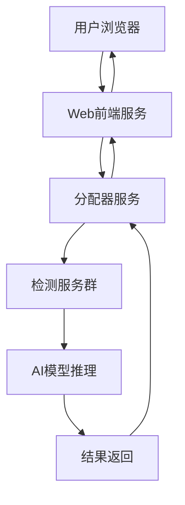

# CUCDFD 深度鉴伪系统 - Web前端服务

## 📋 服务概述

`web.py` 是CUCDFD深度鉴伪系统的Web前端服务器，基于Python内置HTTP服务器构建，为用户提供友好的Web界面来访问深度伪造检测功能。

### 🎯 主要功能

| 功能 | 描述 | 技术实现 |
|------|------|----------|
| **静态文件服务** | 提供HTML、CSS、JS等前端资源 | Python SimpleHTTPRequestHandler |
| **API地址动态替换** | 自动配置后端API地址 | 字符串替换机制 |
| **移动端适配** | 响应式界面支持多设备访问 | CSS媒体查询 |
| **文件上传界面** | 响应式文件上传体验 | JavaScript + FormData |

### 🏗️ 系统架构位置

```
用户浏览器 ──→ Web前端服务 (8080) ──→ 分配器服务 (5000) ──→ 检测服务群 (35331+)
    │              │                    │                      │
  界面交互        静态资源服务          任务调度              AI模型推理
  文件上传        API地址代理           负载均衡              结果生成
```

### 🔧 工作原理

1. **深度拷贝**: 将Web目录的所有文件复制到临时目录
2. **字符串替换**: 在临时目录中将所有文件里的 `cucdfd-backend-api` 替换为指定的API地址
3. **HTTP服务**: 在指定端口启动HTTP服务器，服务临时目录中的文件
4. **自动清理**: 服务停止后自动清理临时文件

## 🚀 部署和使用

### 方法一：通过主系统启动（推荐）

Web前端服务已集成到CUCDFD主配置系统中，推荐使用主启动脚本：

```bash
# 在项目根目录启动整个系统（包括Web前端）
cd /home/cucdfd/桌面/cucdfd
./start_all.sh

# 停止整个系统
./stop_all.sh

# 查看启动状态
screen -ls | grep cucdfd
```

### 方法二：单独启动Web服务

如果只需要启动Web前端服务：

```bash
# 进入Web服务目录
cd /home/cucdfd/桌面/cucdfd/web

# 激活Conda环境
conda activate cucdfd

# 在8080端口启动前端服务，API地址为本地分配器
python web.py --port 8080 --api http://localhost:5000

# 连接到远程API服务器
python web.py --port 8080 --api http://192.168.1.100:5000

# 后台启动（使用screen）
screen -dmS cucdfd_web python web.py --port 8080 --api http://localhost:5000

# 查看后台服务状态
screen -r cucdfd_web

# 从screen会话退出（不终止服务）
# 按 Ctrl+A，然后按 D
```

### 方法三：使用独立启动脚本

Web目录提供了独立的启动和停止脚本：

```bash
# 进入Web服务目录
cd /home/cucdfd/桌面/cucdfd/web

# 使用默认配置启动（端口8000，API地址localhost:5000）
./start_web.sh

# 自定义端口和API地址
./start_web.sh -p 9000 -a http://192.168.1.100:5000
./start_web.sh --port 9000 --api http://192.168.1.100:5000

# 查看帮助信息
./start_web.sh --help

# 停止服务
./stop_web.sh
```

## ⚙️ 配置说明

### 主配置文件

Web前端服务的配置位于主配置文件 `/home/cucdfd/桌面/cucdfd/config.yml` 中：

```yaml
# Web前端模块配置
web_module:
  # 是否启用Web前端服务
  enabled: true
  # Web服务端口
  port: 8080
  # API后端地址（通常指向分配器服务）
  api_url: "http://localhost:5000"
```

### 配置参数说明

| 参数 | 类型 | 默认值 | 描述 |
|------|------|--------|------|
| `enabled` | boolean | true | 控制是否启动Web前端服务 |
| `port` | int | 8080 | Web服务监听端口 |
| `api_url` | string | http://localhost:5000 | API后端地址 |

### 环境变量支持

```bash
# 通过环境变量覆盖配置
export CUCDFD_WEB_PORT=9000
export CUCDFD_API_URL=http://192.168.1.100:5000

# 启动服务
python web.py --port $CUCDFD_WEB_PORT --api $CUCDFD_API_URL
```

## 🌐 Web界面功能

### 主界面特性

| 功能区域 | 描述 | 技术细节 |
|----------|------|----------|
| **文件上传区** | 响应式文件上传界面 | 进度显示 |
| **格式验证** | 实时文件格式和大小检查 | JavaScript客户端验证 |
| **进度监控** | 实时显示检测进度 | Ajax轮询 + 进度条 |
| **结果展示** | 检测结果可视化展示 | 动态DOM更新 |
| **报告下载** | PDF报告下载功能 | 直接文件下载链接 |

### 支持的文件格式

| 媒体类型 | 支持格式 | 最大文件大小 | 界面提示 |
|---------|---------|-------------|----------|
| **视频** | mp4 | 10MB | 实时格式检查 |
| **图像** | jpg, png, jpeg, tif, webp | 10MB | 预览原图 |
| **音频** | wav, mp3, m4a, pcm, flac | 10MB | 音频播放显示 |

### 移动端适配

```css
/* 响应式设计断点 */
@media (max-width: 768px) {
  /* 平板适配 */
}

@media (max-width: 480px) {
  /* 手机适配 */
}
```

- **自适应布局**: 根据屏幕尺寸调整界面布局
- **触摸优化**: 支持触摸操作和手势
- **移动端检测**: 自动识别移动设备并优化体验

## 🔧 高级配置

### API地址替换机制

Web服务使用智能字符串替换机制，将前端代码中的占位符替换为实际API地址：

```javascript
// 前端代码中使用占位符
const API_BASE = 'cucdfd-backend-api';
fetch(`${API_BASE}/taskdoor`, {
    method: 'POST',
    body: formData
});
```

```html
<!-- HTML文件中使用占位符 -->
<script>
const apiUrl = 'cucdfd-backend-api';
const ws = new WebSocket(`ws://${apiUrl.replace('http://', '')}/ws`);
</script>
```

### 支持的替换文件类型

- **HTML文件**: *.html, *.htm
- **JavaScript文件**: *.js
- **CSS文件**: *.css
- **配置文件**: *.json, *.xml
- **模板文件**: *.vue, *.tsx

### 集群部署配置

```bash
# 多实例负载均衡配置
# 实例1 - 主服务器
./start_web.sh -p 8080 -a http://localhost:5000

# 实例2 - 备用服务器
./start_web.sh -p 8081 -a http://192.168.1.101:5000

# 实例3 - 开发环境
./start_web.sh -p 8082 -a http://dev-server:5000
```

### HTTPS支持配置

```bash
# 使用反向代理实现HTTPS
# Nginx配置示例
server {
    listen 443 ssl;
    server_name cucdfd.example.com;
    
    ssl_certificate /path/to/cert.pem;
    ssl_certificate_key /path/to/key.pem;
    
    location / {
        proxy_pass http://localhost:8080;
        proxy_set_header Host $host;
        proxy_set_header X-Real-IP $remote_addr;
    }
}
```

## 📊 监控和调试

### 服务状态监控

```bash
# 查看所有CUCDFD相关的Screen会话
screen -ls | grep cucdfd

# 连接到Web前端服务会话
screen -r cucdfd_web

# 查看系统启动日志
tail -f /home/cucdfd/桌面/cucdfd/logs/startup.log

# 查看系统关闭日志
tail -f /home/cucdfd/桌面/cucdfd/logs/shutdown.log
```

### 端口和连接监控

```bash
# 检查Web服务端口是否在监听
ss -tln | grep :8080
netstat -tlnp | grep :8080

# 检查进程状态
ps aux | grep web.py

# 监控并发连接数
ss -t | grep :8080 | wc -l

# 实时监控网络流量
iftop -i eth0 -f "port 8080"
```

### 性能分析

```bash
# Web服务内存使用
ps -o pid,ppid,cmd,%mem,%cpu -p $(pgrep -f web.py)

# HTTP请求日志分析
tail -f /var/log/nginx/access.log | grep cucdfd

# 错误日志监控
grep -i error /home/cucdfd/桌面/cucdfd/logs/*.log
```

## 🔧 故障排除

### 常见问题及解决方案

#### 1. 服务启动失败

**问题**: 端口被占用
```bash
# 查找占用进程
lsof -i :8080
ss -tulpn | grep :8080

# 终止占用进程
kill -9 <PID>

# 或修改端口配置
vim /home/cucdfd/桌面/cucdfd/config.yml
```

**问题**: 权限不足
```bash
# 检查文件权限
ls -la /home/cucdfd/桌面/cucdfd/web/

# 修复权限
chmod +x /home/cucdfd/桌面/cucdfd/web/*.sh
chmod 644 /home/cucdfd/桌面/cucdfd/web/*.html
```

#### 2. API连接问题

**问题**: 无法连接到分配器服务
```bash
# 测试分配器服务连通性
curl -I http://localhost:5000/

# 检查分配器服务状态
screen -r cucdfd_distributer

# 验证网络连接
telnet localhost 5000
```

**问题**: 跨域问题
```javascript
// 在前端代码中添加CORS处理
fetch(apiUrl, {
    method: 'POST',
    mode: 'cors',
    credentials: 'include',
    body: formData
});
```

#### 3. 文件上传问题
**问题**: 文件大小限制
```python
# 文件大小限制为
MAX_FILE_SIZE = 10 * 1024 * 1024  # 10MB
```

#### 4. 界面显示异常

**问题**: 静态资源加载失败
```bash
# 检查文件完整性
find /home/cucdfd/桌面/cucdfd/web -name "*.css" -o -name "*.js" | xargs ls -la

# 重新部署前端文件
cd /home/cucdfd/桌面/cucdfd/web
```

**问题**: API地址替换失败
```bash
# 手动验证替换结果
grep -r "cucdfd-backend-api" /tmp/tmp*/

# 检查替换逻辑
python -c "
import os
os.chdir('/home/cucdfd/桌面/cucdfd/web')
exec(open('web.py').read())
"
```

### 服务重置和恢复

#### 完全重置Web服务
```bash
#!/bin/bash
echo "重置CUCDFD Web前端服务..."

# 1. 停止Web服务
./stop_web.sh

# 2. 清理临时文件
find /tmp -name "tmp*" -type d -user $(whoami) | while read dir; do
    if [[ -f "$dir/web.py" ]]; then
        echo "清理临时目录: $dir"
        rm -rf "$dir"
    fi
done

# 3. 清理Screen会话
screen -wipe

# 4. 重新启动
sleep 2
./start_web.sh

echo "Web服务重置完成"
```

#### 配置文件恢复
```bash
# 备份当前配置
cp /home/cucdfd/桌面/cucdfd/config.yml config.yml.backup

# 重新启动服务
cd /home/cucdfd/桌面/cucdfd
./stop_all.sh && ./start_all.sh
```

## 📁 项目文件结构

```
web/                                    # Web前端服务目录
├── 📄 web.py                          # 主服务器脚本
├── 🚀 start_web.sh                    # 独立启动脚本
├── 🛑 stop_web.sh                     # 独立停止脚本
├── 📖 README.md                       # 本文档
├── 🌐 index.html                      # 桌面版主页面
├── 📱 wap.html                        # 移动版主页面
├── 📂 panel/                          # 检测面板界面
│   ├── index.html                     # 桌面版检测界面
│   ├── wap.html                       # 移动版检测界面
│   └── css/                           # 面板专用样式
├── 📂 css/                            # 样式文件目录
│   ├── style.css                      # 主样式表
│   ├── panel.css                      # 面板样式
│   └── pond.css                       # 动效样式
├── 📂 js/                             # JavaScript文件目录
│   ├── panel.js                       # 面板交互逻辑
│   └── app.js                         # 应用主逻辑
├── 📂 img/                            # 图片资源目录
│   ├── logo.png                       # 系统Logo
│   ├── bv.mp4                         # 背景视频
│   └── *.png                          # 其他图片资源
└── 📂 fonts/                          # 字体文件目录
```

### 关键文件说明

| 文件 | 用途 | 重要性 |
|------|------|--------|
| `web.py` | 核心服务器脚本 | ⭐⭐⭐⭐⭐ |
| `index.html` | 桌面版主页 | ⭐⭐⭐⭐ |
| `panel/index.html` | 检测功能页面 | ⭐⭐⭐⭐⭐ |
| `start_web.sh` | 启动脚本 | ⭐⭐⭐ |
| `css/panel.css` | 核心样式 | ⭐⭐⭐ |

## 🔗 集成与扩展

### 与CUCDFD系统集成

Web前端服务作为CUCDFD深度鉴伪系统的用户界面层，与其他组件的集成关系：



### API接口集成

```javascript
// 主要API调用示例
class CUCDFDWebClient {
    constructor(apiBase) {
        this.apiBase = apiBase;
    }
    
    // 提交检测任务
    async submitTask(file) {
        const formData = new FormData();
        formData.append('file', file);
        
        const response = await fetch(`${this.apiBase}/taskdoor`, {
            method: 'POST',
            body: formData
        });
        
        return response.json();
    }
    
    // 查询任务状态
    async checkTask(taskId) {
        const formData = new FormData();
        formData.append('taskid', taskId);
        
        const response = await fetch(`${this.apiBase}/check`, {
            method: 'POST',
            body: formData
        });
        
        return response.json();
    }
}
```

### 第三方集成

```bash
# 与其他系统集成的环境变量
export CUCDFD_EXTERNAL_API=http://external-system:5000
export CUCDFD_AUTH_TOKEN=your-auth-token

# 启动时传递外部配置
python web.py --port 8080 --api $CUCDFD_EXTERNAL_API
```

## 📚 使用场景

### 开发环境

```bash
# 开发时连接到本地后端
./start_web.sh -p 3000 -a http://localhost:5000
```

### 测试环境

```bash
# 测试时连接到测试服务器
./start_web.sh -p 8080 -a http://test-api.cucdfd.com:5000
```

### 生产环境

```bash
# 生产环境部署
./start_web.sh -p 8080 -a https://api.cucdfd.com
```

### 演示环境

```bash
# 演示时快速切换后端
./stop_web.sh
./start_web.sh -p 8080 -a http://demo-server:5000
```

---

**📋 文档信息**
- **版本**: v1.0
- **更新日期**: 2025年5月
- **模块**: Web前端服务
- **维护**: CUCDFD团队

**🔗 相关文档**
- [项目主文档](../README.md) - 完整系统说明
- [分配器服务文档](../distributer/README.md) - 任务分发服务
- [检测服务文档](../cucdfd_service/README.md) - AI检测服务
- [环境配置指南](../appendices/environment/env%20setup.md) - 环境安装配置

**⚠️ 重要提醒**:
- Web前端服务依赖于分配器服务，请确保分配器已正常启动
- 前端代码中必须使用 `cucdfd-backend-api` 作为API地址占位符
- 服务停止后临时文件会自动清理，无需手动干预
- 移动端访问建议使用Chrome或Safari浏览器

**🎯 性能建议**:
- 建议将静态资源部署到CDN提升加载速度
- 启用Gzip压缩减少传输大小
- 使用Nginx等反向代理提升并发性能
- 定期清理临时文件避免磁盘空间不足
